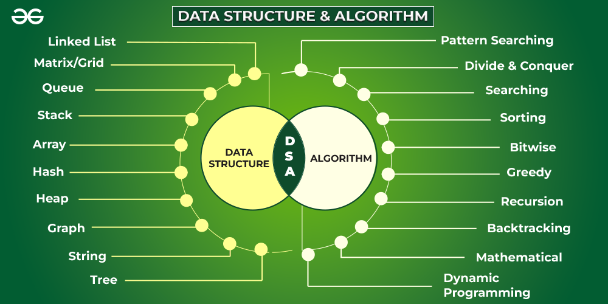

# DSA Questions and Answers Repository



Welcome to the **DSA Questions and Answers Repository**! This repository is a comprehensive collection of questions and solutions related to Data Structures and Algorithms (DSA). Whether you're a student preparing for exams, a developer preparing for technical interviews, or simply someone looking to improve your problem-solving skills, this repository is designed to be a valuable resource.

## Contents

- **Array and Strings**: Problems and solutions involving arrays and string manipulation.
- **Linked Lists**: A variety of linked list problems, including single, double, and circular linked lists.
- **Stacks and Queues**: Solutions to problems related to stack and queue data structures.
- **Trees and Graphs**: A collection of problems involving binary trees, binary search trees, AVL trees, graph traversals, and more.
- **Hashing**: Problems related to hash tables and hash maps.
- **Sorting and Searching**: Implementation of various sorting algorithms and search techniques.
- **Dynamic Programming**: Problems demonstrating dynamic programming concepts and techniques.
- **Greedy Algorithms**: Solutions using the greedy approach.
- **Recursion and Backtracking**: Recursive problem solutions and backtracking techniques.
- **Bit Manipulation**: Problems involving bitwise operations.
- **Mathematical Algorithms**: Math-based algorithm problems.
- **Miscellaneous**: Other algorithmic problems and solutions that don't fit into the above categories.

## Features

- **Well-Commented Code**: Each solution is well-commented to explain the logic and approach used.
- **Solution Languages**: Solutions are provided in Python programming language.
- **Difficulty Levels**: Questions are categorized based on difficulty levels: Easy, Medium, and Hard.
- **Contributions Welcome**: We encourage the community to contribute by adding new questions, optimizing existing solutions, or providing solutions in different languages.

## How to Use

1. **Browse the Repository**: Navigate through the folders to find problems categorized by data structure or algorithm type.
2. **Read the Problem Statement**: Each problem is accompanied by a detailed problem statement.
3. **Study the Solution**: Review the provided solution, which includes a step-by-step explanation and code.
4. **Practice**: Try to solve the problems on your own before checking the solutions.
5. **Contribute**: Submit your own problems and solutions to help the community grow.

## Contributing

We welcome contributions from everyone. If you have a new problem, an optimized solution, or solutions in different programming languages, feel free to submit a pull request. Please make sure your contributions are well-documented and follow the repository's structure.

## License

You are free to use, modify, and distribute the code as long as you provide attribution to the original source.

## Getting Started

To get started, clone this repository to your local machine:

```bash
git clone https://github.com/your-username/dsa-questions-and-answers.git
```
Happy Coding!